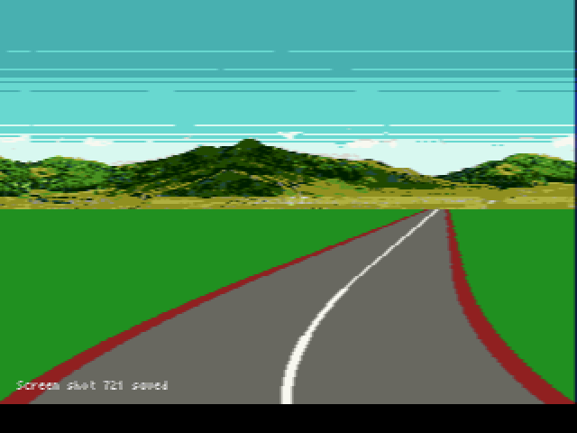

# Simple Curves
This code is based on the [Curves and Steering](http://www.extentofthejam.com/pseudo/#curves) section of [Lou's Pseudo 3d Page](http://www.extentofthejam.com/pseudo).  Unlike my [previous example](https://github.com/radioation/MegaDriving/tree/main/00_turns) I'm now using two road segments for curves and adding a second scroll plane.

## Road Segments
As seen in [Curves and Steering](http://www.extentofthejam.com/pseudo/#curves), Lou allows two segments on screen at a time.  Each segment has its own rate of change for the road (`dx`).   I'm adding a background image that scrolls when the player is on a curved segment.  Each segment will also have it's on rate of change for the background.  A simple struct can be used to hold both of these values:

~~~c
typedef struct
{
	fix16 dx;  // rate of change for the road.
	fix16 bgdx; // rate of change for background.
} ROAD_SEGMENT;
~~~

A track can be created with a `ROAD_SEGMENT` array.  In my example I'm defining a track composed of 13 road segments.   The first value sets `dx` and the second sets `bgdx`
~~~c
#define ROAD_SEGMENTS_LENGTH 13
const ROAD_SEGMENT segments[ROAD_SEGMENTS_LENGTH] = {
		{FIX16(0), FIX16(0)},
		{FIX16(-0.02), FIX16(0.120)},
		{FIX16(-0.04), FIX16(0.32)},
		{FIX16(-0.02), FIX16(0.120)},
		{FIX16(0), FIX16(0)},
		{FIX16(0), FIX16(0)},
		{FIX16(0.06), FIX16(-0.36)},
		{FIX16(-0.06), FIX16(0.36)},
		{FIX16(0), FIX16(0)},
		{FIX16(0.02), FIX16(-0.12)},
		{FIX16(0), FIX16(0)},
		{FIX16(-0.03), FIX16(0.18)},
		{FIX16(0.03), FIX16(-0.18)}};
~~~
When `dx` is FIX16(0) it means the segment is straight. Negative `dx` values curve the road to the left.  Positive values curve the road to the right.  Similarly, when `bdgx` is FIX16(0) it means the background will not be scrolling.    Positive `bgdx` values will scroll the background to the right.  Negative values will scroll the background to the left. 

## Curving the Road

~~~c
void update()
{
	fix16 current_x = FIX16(0); // Lou's pseudo 3d page says to use Half of the screen width,
															// but I've defined SCROLL_CENTER to handle this

	fix16 dx = FIX16(0);	// Curve amount, constant per segment.
	fix16 ddx = FIX16(0); // Curve amount, changes per line

	// for each line of the screen from the bottom to the top
	// I've defined the ZMAP to have the bottom of the screen
	// (nearest position) start at zmap[0]
	for (u16 y = 0; y < ZMAP_LENGTH; ++y)
	{
		fix16 z = zmap[y];
		// if line of screen's Z Map position is below segment position
		if (z < segment_position)
		{
			// dx = bottom_segment.dx
			dx = segments[bottom_segments_index].dx;
		}
		else // if line of Screen's Z map position is above segment position.
		{
			// dx = segment.dx
			dx = segments[segments_index].dx;
		}

		// ddx += dx
		ddx = fix16Add(ddx, dx);
		// current_x += ddx
		current_x = fix16Add(current_x, ddx);

		// this_line.x = current_x
		// we'll use horizontal scrolling of BG_A to fake curves.
		HscrollA[223 - y] = SCROLL_CENTER + fix16ToInt(current_x);
	}

	// scroll the background
	background_position = fix16Sub(background_position, segments[bottom_segments_index].bgdx);
	for (u16 y = 0; y < 120; ++y)
	{
		HscrollB[y] = fix16ToInt(background_position);
	}

	// Move segments
	segment_position = fix16Add(segment_position, speed);
	if (fix16ToInt(segment_position) < 0) // 0 is nearest
	{
		// bottom_segment = segment
		bottom_segments_index = segments_index;

		// segment.position = zmap.length - 1
		segment_position = zmap[ZMAP_LENGTH - 1]; // Send segment to farthest visible distance
		// fetch next segment from road
		segments_index++; // segment_index is used to get segment.dx
		if (segments_index == ROAD_SEGMENTS_LENGTH)
		{
			segments_index -= ROAD_SEGMENTS_LENGTH; // go back to the start
		}
	}
}

~~~

